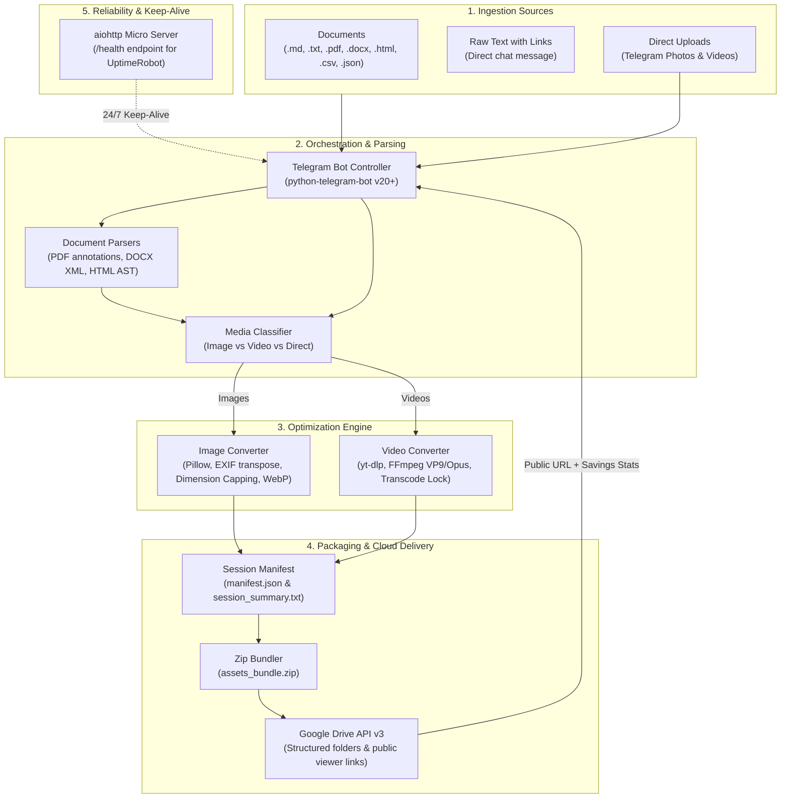

# ⚡ WebAssetify

[](https://github.com/FatirGibran/WebAssetify/actions/workflows/ci.yml)
[](https://www.python.org/)
[](https://core.telegram.org/bots/api)
[](https://developers.google.com/drive)
[](LICENSE)

> **High-Performance Asynchronous Media Harvester, Modern Web Optimizer (`.webp` / `.webm`), and Cloud Delivery Pipeline Orchestrated via Telegram.**

WebAssetify is an end-to-end automation bot that ingests documents (`.md`, `.txt`, `.pdf`, `.docx`, `.html`, `.csv`, `.json`), raw web links, or direct media uploads. It automatically downloads media, downscales & converts images to lightweight **WebP**, transcodes video streams (YouTube, direct MP4, etc.) to low-memory **WebM**, packages everything into an `assets_bundle.zip` with detailed manifest metrics, and uploads the results directly to Google Drive.

---

## 🏗️ Architecture Pipeline



---

## ✨ Key Features

- **Multi-Format Document Ingestion:**
  - **PDF:** Extracts visible text links and clickable `/URI` annotation hyperlinks (`pypdf`).
  - **Word (DOCX):** Parses paragraphs, tables, and internal XML relationship hyperlinks (`python-docx`).
  - **HTML:** Extracts `<a>`, `<link>`, `` (`src`, `data-src`, `srcset`), `<video>`, `<source>`, `<iframe>`, and CSS inline background URLs.
  - **Spreadsheets & Data:** Scans `.csv`, `.tsv`, and `.json` files for web assets.
  - **Markdown & Plain Text:** Extracts standard markdown `[text](url)` and `` formats.
- **Direct Chat Media Processing:**
  - Send photos directly in chat for instant WebP compression.
  - Send videos directly in chat for low-bitrate WebM transcoding.
- **Smart Image Optimization:**
  - Converts images to modern `.webp` with configurable quality.
  - **EXIF Auto-Orientation:** Automatically corrects rotated phone photos via `ImageOps.exif_transpose`.
  - **Dimension Capping:** Dynamically downscales oversized images (e.g. 4K/8K) to safe boundaries while maintaining aspect ratio.
  - Non-blocking parallel worker execution using `asyncio.to_thread`.
- **Low-Memory Video Transcoding:**
  - Supports YouTube, Vimeo, TikTok, and direct video links via `yt-dlp`.
  - Single-concurrency lock (`_TRANSCODE_LOCK`) and tuned FFmpeg flags (`libvpx-vp9`, `-threads 1`, `-speed 4`, `-crf 32`) preventing container OOM errors under 512MB RAM constraints.
- **Automated Cloud Delivery:**
  - Creates structured timestamped folders in Google Drive: `WebAssetify_YYYYMMDD_HHMMSS_<user_id>/`.
  - Generates `manifest.json` and human-readable `session_summary.txt` documenting session statistics.
  - Automatically zips all assets into `assets_bundle.zip`.
  - Applies public viewer permissions and returns clickable Drive URLs.
- **Real-Time Storage Savings Feedback:**
  - Calculates and reports exact megabytes saved and percentage compression ratio directly to the user.
- **24/7 Cloud Ready:**
  - Integrated `aiohttp` micro-webserver on port 8080 running concurrently in the same asyncio event loop for keep-alive monitoring (Render, Railway, Fly.io, UptimeRobot).

---

## 📁 Google Drive Output Structure

```text
Google Drive / WebAssetify_Vault /
└── WebAssetify_20260916_124500_123456789/
    ├── manifest.json
    ├── session_summary.txt
    ├── assets_bundle.zip
    ├── images/
    │   ├── 001_hero-banner.webp
    │   └── 002_product-mockup.webp
    └── videos/
        └── 001_demo-showcase.webm
```

---

## 🤖 Bot Commands

| Command | Description |
| :--- | :--- |
| `/start` | Welcome overview, feature breakdown, and quick guide |
| `/help` | Detailed instructions on supported document formats |
| `/status` | Real-time system health, service uptime, and configuration |
| `/ping` | Fast response latency diagnostic |

---

## ⚙️ Environment Variables

Create a `.env` file in the root directory (refer to [`.env.example`](.env.example)):

| Variable | Required | Default | Description |
| :--- | :---: | :---: | :--- |
| `TELEGRAM_BOT_TOKEN` | **Yes** | — | Telegram Bot API token from [@BotFather](https://t.me/botfather) |
| `GDRIVE_PARENT_FOLDER_ID` | **Yes** | — | ID of target Google Drive parent folder |
| `GDRIVE_SERVICE_ACCOUNT_JSON`| **Yes** | — | Raw JSON string or path to Google Service Account credentials file |
| `PORT` | No | `8080` | Port for the keep-alive micro HTTP server |
| `WEBP_QUALITY` | No | `80` | Image compression quality (`1` to `100`) |
| `MAX_IMAGE_DIMENSION` | No | `2560` | Max width/height in pixels before downscaling |
| `MAX_VIDEO_HEIGHT` | No | `720` | Max video resolution height (`720`, `1080`, etc.) |
| `TEMP_DIR` | No | `/tmp/webassetify` | Scratch folder for temporary processing files |

---

## 🚀 Quick Start (Local Setup)

### 1. Prerequisites
- Python 3.10 or 3.11
- FFmpeg installed (`brew install ffmpeg` on macOS or `sudo apt install ffmpeg` on Ubuntu)

### 2. Clone and Setup Environment
```bash
git clone https://github.com/Fatirrr08/WebAssetify.git
cd WebAssetify

python3 -m venv .venv
source .venv/bin/activate
pip install -r requirements.txt
```

### 3. Configure Credentials
```bash
cp .env.example .env
# Edit .env with your TELEGRAM_BOT_TOKEN, GDRIVE_PARENT_FOLDER_ID, etc.
```

### 4. Run the Application
```bash
python main.py
```

---

## 🐳 Docker Deployment

A lightweight, multi-stage ready `Dockerfile` based on `python:3.11-slim` with FFmpeg is included.

### Build and Run with Docker:
```bash
# Build Docker image
docker build -t webassetify:latest .

# Run container with environment variables
docker run -d \
  --name webassetify \
  -p 8080:8080 \
  --env-file .env \
  webassetify:latest
```

---

## 🧪 Testing

WebAssetify includes a comprehensive unit test suite covering parsers, converters, storage pipelines, and health servers.

```bash
# Run all tests
pytest -v

# Run with test coverage report
pytest --cov=. -v
```

---

## 📜 Contributing & Guidelines

Contributions are welcome! Please adhere to the project standards:
1. **Async Discipline:** Never use blocking libraries (`requests`, `time.sleep`) in the event loop. Always use `aiohttp` and `asyncio.to_thread`.
2. **Resource Cleanup:** Scratch directories and temporary media must always be removed inside `finally:` blocks.
3. **Conventional Commits:** Use standard commit prefixes (`feat:`, `fix:`, `ci:`, `docs:`, `test:`, `chore:`).

See [docs/CONTRIBUTING.md](docs/CONTRIBUTING.md) for more details.

---

## 📄 License

This project is licensed under the MIT License - see the [LICENSE](LICENSE) file for details.
